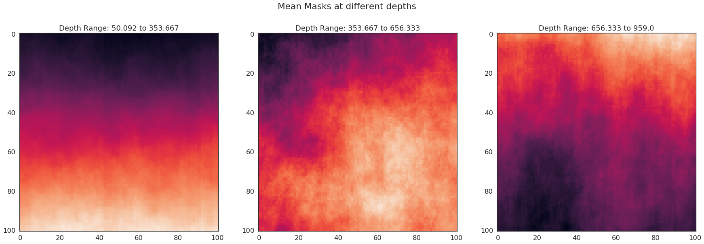

## Image Segmentation Challenge

I participated in Kaggle's TGS Salt Identification Challenge. The main aim of this competition was to segment salt deposits in seismic images.
Salt bodies are important for the hydrocarbon industry, as they usually form nice oil traps. So there's a clear motivation to delineate salt bodies in the subsurface. This repo contains some of my experiments. 

The major highlights of the project are:
1. The Encoder and Decoder Architecture

In the competition, everyone seems to be using ResNet34 encoder.
Keras doesn't provide pre-trained model weights for ResNet34. And kaggle didn't 
support pytorch v0.4 until recently. So, i had to look for other ways..
I experimented with all the pretrained models with different decoder architectures.
After lots of interesting experiments, I found that pretrained Xception model with ResNet decoder works best.

2. Use of Pseudo-Labelling.

After reaching 0.83+, my models started overfitting on the training set.
So, i took multiple models using different encoder architecture and found 
predictions in the test set that are common for every model.
For example, if three different models predict nearly the same mask on the test set, its highly likely the predicted mask is correct. 
In this way i generated two types of masks no-salt masks and some-salt
masks.I used these masks while training.
In the train set nearly 0.39% images don't have mask. I maintained this ratio while using these masks for training (0.39*6000=2340)

3. Using normalized Gradient optimizer

The basic idea is to normalize each layer of the mini-batch stochastic gradient.
It has been shown that the normalized gradient methods having constant step size with occasionally decay, such as SGD with momentum,
have better performance in the deep convolution neural networks, than optimizers with adaptive step sizes likt Adam.
This optimizer was very useful for training my network. Normal SGD takes a very long time to converge.

4. Stochastic Weight Averaging (SWA)

It has been shown in recent paper that SWA finds much broader optima than SGD. I got a boost of around 0.003 with SWA.
It is extremely easy to implement and has very little computational overhead !!

You can find the final code in getting-0-87-on-private-lb-using-kaggle-kernel.ipynb in this repo.
You can run the code on kaggle by forking my [kernel](
https://www.kaggle.com/meaninglesslives/getting-0-87-on-private-lb-using-kaggle-kernel)

This kernel gets 0.854 on Public LB and takes 16666s to run (both training and prediction). The model's performance can be definitely be improved by using some other tricks, one obvious way is to use KFold Cross Validation. You can train with lovasz loss to improve it further. I wanted to keep the kernel simple and run it within time limit, so it is a no frills models.

# The Notebooks
The repo contains the following notebooks
1. data-exploration

In this notebook, I try to explore the TGS Salt Segmentation data. My purpose here is not to set up a segmentation model, but rather to try to explore the provided data and get some sense of what types of features may be useful. I hope you find this helpful.

 | 

 | 

2. simple-image-features

I extract simple features that can be easily extracted and used for training deep networks these features may be used along with original image

 

3. using-resnet50-pretrained-model-in-keras

In this Kernel I show you how to use pre-trained Resnet50 with image size 128. 

 

4. apply-crf
In this notebook I use Conditional Random Fields on the predicted masks. You can use it with your own submission and improve the score significantly by tinkering with this technique. Please refer the paper Conditional Random Fields as Recurrent Neural Networks for more information.
 

5. finding-connected-images-in-python

In this kernel i use KD Trees to find the nearest images and combine them. You can try experimenting with different threshold values and different distance metric to get different combination of images.

6. unet-resnet34-in-keras

I show you how to use Resnet34 from scratch.

7. pretrained-resnet34-in-keras

I show you how to use pre-trained Resnet34 

